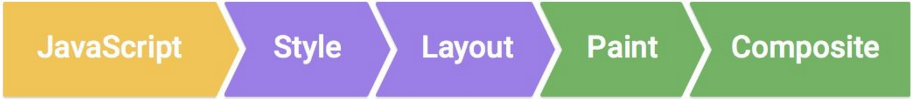

# CSS Houdini

> 想要使用某种 CSS 特性，但是因为浏览器兼容性问题而没法使用？更糟糕一点，所有浏览器都支持这种特性，但支持度不完全，在某些情况下会有 bug 出现、支持性不一致，甚至于完全不兼容。如果你曾经遇到过上述情况（我肯定你一定遇到过），那你得好好关注 Houdini。

可以说 `CSS Houdini` 是近几年大家比较关注的 CSS 技术，它的终极目标是实现 css 属性的完全兼容，它提出了一种设想：将 CSS API 开放给开发者，使其可以通过这套接口自行扩展 CSS

## CSS Houdini 是什么？

让我们先来回顾一下浏览器在渲染网页的过程中，经历了什么？



开发者们能操作的就是通过 JS 去控制 `DOM` 与 `CSSOM`，来影响页面的变化，但是对于接下來的 `Layout`、`Paint` 与 `Composite` 就几乎沒有控制权了

CSS Houdini 是由一群来自 Mozilla, Apple, Opera, Microsoft, HP, Intel, IBM, Adobe 与 Google 的工程师所组成的工作小组，志在建立一系列的 API，让开发者能够介入浏览器的 CSS engine 操作，带给开发者更多的解決方案，用来解決 CSS 长久以来的问题：
* css 属性跨浏览器的问题
* css 编译转换成支持属性的制作困难

## CSS Houdini 提供的 API

* [Typed OM](https://drafts.css-houdini.org/css-typed-om/)
* [Properties / Values](https://drafts.css-houdini.org/css-properties-values-api/)
* [Worklets](https://drafts.css-houdini.org/worklets/)
* [Paint API](https://drafts.css-houdini.org/css-paint-api/)
* [Layout API](https://drafts.css-houdini.org/css-layout-api/)
* [Animation Worklet](https://wicg.github.io/animation-worklet/)
* [Parser API](https://wicg.github.io/CSS-Parser-API/)
* [Font Metrics](https://github.com/w3c/css-houdini-drafts/blob/master/font-metrics-api/README.md)

可以在 [Is Houdini Ready yet](https://ishoudinireadyyet.com/) 这里查到主流浏览器对这些 api 的支持情况

## CSS Type OM

`CSS Typed OM`可以被认为是现在使用的`CSSOM`的第二个版本。它的目标是解决很多现有模型的问题并且会引入`新的CSS解析器API`和`CSS属性和值API`的特性。

Typed OM的另一个主要目标是`改进性能`，将当前CSSOM的字符串值转化成`有意义的类型化的 JavaScript 表达式`会产生显著的性能提升。

旧的 CSSOM 获取 DOM 的样式返回的都是字符串，如
```js
el.style.opacity = 0.3;
typeof el.style.opacity;  // string
```
由于返回的样式都是字符串，所以我们处理的时候都需要再做一层类型转换；而 CSS Type OM 可以帮助我们获取到类型化的数据，我们只需要按照对应的类型做直接处理即可，可以帮助我们更好地计算，更好地做错误处理，而且样式命名与 css 命名一致，不需要纠结是驼峰还是横杠
```js
el.attributeStyleMap.set('opacity', 0.3);
typeof el.attributeStyleMap.get('opacity').value; // number
```
`attributeStyleMap` 属性用来获取元素样式表规则，返回一个 `StylePropertyMap` 对象。 StylePropertyMap 对象类似 Map 对象，所以它们支持所有常见的操作`get / set / keys / values / entries`，处理起来更加灵活高效
```js
el.attributeStyleMap.has('opacity'); // true
el.attributeStyleMap.delete('opacity');
el.attributeStyleMap.clear();    // remove all styles
```
CSS Type OM 还为我们提供了更好的计算方法，比如我们可以这样来创建一个样式值
```js
const { value, unit } = CSS.px(10); // value: 10, unit: px
const { value, unit } = CSS.deg(45); // value: 45, unit: deg
```
更是提供了一些基本运算方法
```js
new CSSMathSum(CSS.vw(10), CSS.px(-10)).toString(); // calc(10vw - 10px)
new CSSMathMin(CSS.percent(80), CSS.px(10)).toString(); // min(80%, 10px)

/** 基本操作(add/sub/mul/div/min/max) */
CSS.deg(45).mul(2); // { value: 90, unit: 'deg' }
CSS.px(1).add(CSS.px(2)); // { value: 3, unit: 'px' }
```
当我们使用 js 去操作 css 的 `transform` 属性时，往往是通过拼接字符串的方法来控制，这样既不利于代码的编写，对可读性也很不好；而 CSS Type OM 为我们提供了 `transform` 属性的对象，为我们更好地操作提供了便利
```js
const transform = new CSSTransformValue([
  new CSSRotate(CSS.deg(45)),
  new CSSScale(CSS.number(2)),
  new CSSTranslate(CSS.px(10), CSS.px(10))
]);
el.attributeStyleMap.set('transform', transform);
```

## Properties / Values

自从 css 变量出现后，广受开发者青睐，但 css 变量并不支持动画，即在 `transition` 属性中监听变量的变化，是不能实现过渡动画的， `Properties / Values` 就是来解决这个问题的

```js
/** 注册变量 */
CSS.registerProperty({
  name: '--variable',
  syntax: '<percentage>',
  inherits: false,
  initialValue: '0%'
});

/** 取消变量绑定 */
CSS.unregisterProperty('--variable');
```

举个例子，按我们常规的写法，定义变量
```css
:root {
  --normal-hue: 120;
  --normal-saturation: 100%;
  --normal-lightness: 50%;
}
input {
  color: hsl(
    var(--normal-hue),
    var(--normal-saturation),
    calc(var(--normal-lightness) / 2));
  border: 10px solid hsl(
    var(--normal-hue),
    var(--normal-saturation),
    var(--normal-lightness));
  /** 注意这里使用 transition ‘监听’ 变量变化 */
  transition:
    --normal-hue 2s,
    --normal-saturation 2s,
    --normal-lightness 2s;
}
input:focus {
  --normal-hue: 270;
  --normal-lightness: 25%;
}
```
但是尝试按照这种方式实现的过渡动画，并没有生效；接下来我们看下使用 `Properties / Value` 的实现

```html
<style>
input {
  color: hsl(
    var(--main-hue),
    var(--main-saturation),
    calc(var(--main-lightness) / 2));
  border: 10px solid hsl(
    var(--main-hue),
    var(--main-saturation),
    var(--main-lightness));
  transition:
    --main-hue 2s,
    --main-saturation 2s,
    --main-lightness 2s;
}
input:focus {
  --main-hue: 270;
  --main-lightness: 25%;
}
</style>
<script>
window.onload = function() {
  if (CSS.registerProperty) {
    CSS.registerProperty({
      name: '--main-hue',
      syntax: '<number>',
      inherits: false,
      initialValue: '0'
    });

    CSS.registerProperty({
      name: '--main-saturation',
      syntax: '<percentage>',
      inherits: false,
      initialValue: '0%'
    });

    CSS.registerProperty({
      name: '--main-lightness',
      syntax: '<percentage>',
      inherits: false,
      initialValue: '0%'
    });
  }
}
</script>
```
我们的 css 属性仍然没变，只是把 css 变量的定义，从 css 中转移到了 js 里，通过 `css houdini` 新提供的 api `CSS.registerProperty` 定义变量，此时我们想要实现的过渡动画即可生效

## Worklets

`Applets` 是小程序的意思，那 `Worklets` 就是小进程，它可以帮助我们更遍历地实现（复用）常用的样式模块，`Paint API`，`Layout API` 以及 `Animation Worklets` 是以此为基础建立的

`Worklets` 的使用方法为：
```javascript
xxxWorklets.addModule('xx.js').then(...);
```

## Paint API

`Paint API` 可以理解为将 Canvas 画布作为 `background-image` 的值，使元素的背景可以根据我们的 ‘画图’ 展示

```css
/** 普通的样式 */
div {
  background-image: url(...);
}

/** 使用 Paint API */
div {
  background-image: paint(...);
}
```

在介绍 `Worklets` 的时候就已经提及了，`Paint API` 是以 `Worklets` 为基础的，因此，其实现当然避免不了使用 `Worklets`，下面是一些简单的实现介绍

```javascript
// xxx.js
registerPaint('xxx', class {
  // 传入的 css 里定义的变量
  static get inputProperties() {
    return ['--variable'];
  }
  // css 里使用 paint() 里传入的参数
  static get inputArguments() {
    return ['<color>', '<angle>', '<length>'];
  }
  /**
   * 具体的绘制方法
   * ctx： 类似 canvas.context，即绘制上下文
   * geom：可以理解为画布的参数
   * props：存储 inputProperties 返回的 css 变量
   * arg：存储 inputArguments 返回的参数
  **/
  paint(ctx, geom, props, arg) {
    console.log(geom);      // { width: 100, height: 100 }
    props.get('--variable'); // value of --variable
    const color = arg[0];   // value of argument[0]
  }
});
```

这就实现了一个简单的 paint，那我们要如何使用呢？

```javascript
// 首先，将我们写好的 xxx.js 引入项目中，这就使用到了 Worklets
CSS.paintWorklet.addModule('xxx.js');
```
```css
/** 然后就可以在 css 里直接使用了 */
div {
  --variable: 10px;
  background-image: paint(xxx, red, 45deg, 1);
}
```

## Layout API

我们介绍了 `Paint API` 是用来 ‘绘制背景’ 的，那顾名思义 `Layout API` 就是用来布局的

```css
/** 普通样式 */
div {
  display: flex;
}

/** 使用 Layout API */
div {
  display: layout(...);
}
```

`Layout API` 开发

```javascript
// xxx.js

registerLayout('xxx', class {
  static get inputProperties() {
    return ['--variable'];
  }
  static get childrenInputProperties() {
    return ['--variable-child'];
  }
  intrinsicSizes(children, styleMap) {}
  layout(children, constrantSpace, styleMap, breakToken) {}
});
```

使用

```javascript
CSS.layoutWorklet.addModule('xxx.js');
```

```css
div {
  display: layout(xxx);
}
```

由于 `Layout API` 现在支持度不高，且 api 理解复杂，我也还没完全弄清楚，暂时不在此详细展开

## Animation Worklet

根据对 `Paint API` 与 `Layout API` 的介绍，`Animation Worklet` 的功能也能很好的理解，就是通过提供制定好的动画组件，可以方便地引入其他项目中运行；由于 `Animation Worklet` api 也很复杂，支持度也不高，在此也不展开介绍

## 总结

`CSS Houdini` 曾经备受瞩目，如果真的完全支持了，对开发者确实是一件拍手称快的事，但也是由于兼容性问题，现在仍不能由于生产环境，不过对于开发者来说，早点学习了解也有好处，说不定哪天可以用了，那不就信手拈来。 